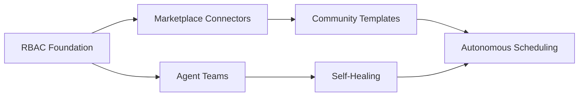

# Phase 3: Marketplace, Agent Teams & Enterprise Features

## Overview

Phase 3 transforms WorkOs AI from a single-user automation tool into a **collaborative, self-sustaining platform ecosystem**. It introduces community-driven content (marketplace + templates), multi-agent orchestration, autonomous operations, and enterprise-grade access control.

---

## 1. Marketplace

### Concept

A publicly accessible store where users can **publish, discover, install, and version** connectors, workflow templates, and agent configurations. Modeled after marketplaces like VS Code Extensions, Shopify Apps, and Zapier's integrations.

### Key Features

| Feature | Description |
|---------|-------------|
| **Connector Publishing** | Developers can submit new connectors with schemas, OAuth configs, and action definitions |
| **Versioning** | Semantic versioning for every connector/template with changelogs and migration guides |
| **Ratings & Reviews** | Community feedback, usage stats, and quality scores |
| **Approval Workflow** | Admin review queue for submissions (automated scanning + manual review) |
| **Installation Management** | One-click install, update notifications, deprecation warnings |

### Technical Considerations

- **Connector Schema Registry** — a database of connector definitions (actions, triggers, input/output schemas) stored as versioned JSON/Pydantic models
- **Package Format** — each connector is a versioned bundle containing:
  - `manifest.json` — metadata (name, author, version, permissions, icon)
  - `schema.json` — OpenAPI-like action/trigger definitions
  - `auth.json` — OAuth 2.0 / API key configuration schema
- **Distribution** — connectors are fetched from a registry API; caching via Cloudflare R2 + CDN
- **Security** — connectors run in a sandboxed environment (subprocess isolation / WASM / container); permissions are declared and user-approved at install time
- **Monetization** (future) — paid connectors with revenue sharing

### Schema Design

```sql
CREATE TABLE marketplace_connectors (
  id UUID PRIMARY KEY,
  name VARCHAR(255) NOT NULL,
  slug VARCHAR(255) UNIQUE NOT NULL,
  description TEXT,
  author_id UUID REFERENCES users(id),
  current_version VARCHAR(50),
  icon_url TEXT,
  categories TEXT[],      -- "crm", "productivity", "ai"
  permissions TEXT[],      -- declared OAuth scopes
  is_verified BOOLEAN DEFAULT false,
  install_count INTEGER DEFAULT 0,
  created_at TIMESTAMPTZ,
  updated_at TIMESTAMPTZ
);

CREATE TABLE connector_versions (
  id UUID PRIMARY KEY,
  connector_id UUID REFERENCES marketplace_connectors(id),
  version VARCHAR(50) NOT NULL,
  manifest JSONB NOT NULL,
  schema JSONB NOT NULL,       -- full action/trigger definitions
  auth_config JSONB,           -- OAuth template
  changelog TEXT,
  is_deprecated BOOLEAN DEFAULT false,
  created_at TIMESTAMPTZ,
  UNIQUE(connector_id, version)
);

CREATE TABLE connector_installs (
  id UUID PRIMARY KEY,
  organization_id UUID REFERENCES organizations(id),
  connector_id UUID REFERENCES marketplace_connectors(id),
  installed_version VARCHAR(50),
  config JSONB,                -- user's auth credentials
  enabled BOOLEAN DEFAULT true,
  created_at TIMESTAMPTZ
);
```

### UI Components

- **MarketplacePage** — browse/search/filter connectors and templates
- **ConnectorDetailPage** — screenshots, versions, reviews, install button
- **PublisherDashboard** — analytics, version management, submission flow
- **InstallWizard** — guided OAuth flow after install

---

## 2. Community Templates

### Concept

A library of **user-submitted, shareable workflow blueprints** that anyone can install and customize. Think GitHub Gists for automations.

### Key Features

- **Template Gallery** — searchable, categorized collection
- **One-Click Install** — import a template into the user's workspace with a single click
- **Customizable Parameters** — templates define input variables (e.g., Slack channel, Sheet ID) that users fill in after install
- **Forking** — users can fork a template, modify it, and re-publish as a new template
- **Analytics** — usage stats, success rate, average execution time per template

### Template Format

```yaml
# template manifest
name: "New Lead → Notion Page + Slack Alert"
description: "When a new HubSpot lead is created, summarize the company, create a Notion page, and notify Slack."
version: "1.0.0"
author:
  name: "Jane Doe"
  avatar: "https://..."
category: "sales"
tags: ["hubspot", "notion", "slack", "leads"]

parameters:
  - key: "slack_channel"
    label: "Slack Channel"
    type: "string"
    default: "#sales-leads"
    required: true
  - key: "notion_database_id"
    label: "Notion Database ID"
    type: "string"
    required: true

triggers:
  - connector: "hubspot"
    event: "contact.created"

steps:
  - id: "summarize"
    connector: "openai"
    action: "chat.completion"
    input:
      prompt: "Summarize this company: {{ trigger.company }}"
  - id: "create_notion"
    connector: "notion"
    action: "page.create"
    depends_on: ["summarize"]
    input:
      database_id: "{{ parameters.notion_database_id }}"
      title: "{{ trigger.company_name }}"
      content: "{{ summarize.output }}"
  - id: "slack_notify"
    connector: "slack"
    action: "message.send"
    depends_on: ["create_notion"]
    input:
      channel: "{{ parameters.slack_channel }}"
      text: "New lead: {{ trigger.company_name }} - Notion page created!"
```

### Technical Considerations

- **Template Engine** — YAML/JSON-based DAG definitions that map directly to the `workflows` and `workflow_steps` tables
- **Parameter Injection** — template parameters are injected at install time using a templating syntax (`{{ }}`)
- **Validation** — on publish, the system validates: all referenced connectors exist, parameter types match, no circular dependencies
- **Versioning** — templates follow semver; users are notified when a template they use has an update
- **Cloning vs Reference** — when a user installs a template, it's cloned into their workspace as an editable workflow, not a symlink

---

## 3. Agent Teams

### Concept

Multiple AI agents collaborate on a single workflow, each with a **specialized role**. Instead of one agent doing everything, a team of agents delegates, parallelizes, and escalates.

### Architecture

```


                    ┌──────────────────────────┐
                    │       Orchestrator       │
                    │    (Manager Agent)        │
                    └──────────┬───────────────┘
                               │
           ┌───────────────────┼───────────────────┐
           │                   │                   │
           ▼                   ▼                   ▼
    ┌─────────────┐    ┌─────────────┐    ┌─────────────┐
    │   Planner   │    │  Researcher │    │  Executor   │
    │   Agent     │    │   Agent     │    │   Agent     │
    └─────────────┘    └─────────────┘    └─────────────┘
           │                   │                   │
           ▼                   ▼                   ▼
    ┌─────────────┐    ┌─────────────┐    ┌─────────────┐
    │  Breaks     │    │  Gathers    │    │  Calls APIs │
    │  intent     │    │  context    │    │  handlest   │
    │  into steps │    │  from web   │    │  responses  │
    └─────────────┘    └─────────────┘    └─────────────┘
```

### Agent Roles

| Agent | Responsibility |
|-------|---------------|
| **Orchestrator** | Receives user intent, decomposes into sub-tasks, assigns agents, monitors progress, reports results |
| **Planner** | Designs the DAG — selects connectors, maps parameters, defines conditions/loops |
| **Researcher** | Gathers external context (company info, docs, sentiment analysis, web search) |
| **Executor** | Calls connector APIs, handles responses, manages pagination and rate limits |
| **Validator** | Checks outputs for correctness, type mismatches, and errors before proceeding |
| **Human Liaison** | Handles approval requests, clarification questions, and user interaction |

### Communication Model

- **Shared Context** — agents share a read/write context store (Redis + PostgreSQL) containing:
  - Workflow state (step outputs, errors, retry count)
  - Conversation history with the user
  - External data fetched during execution
- **Message Bus** — agents communicate via a Redis pub/sub channel or internal async queue
- **Escalation** — if an agent cannot resolve an issue after `n` retries, it escalates to the Orchestrator, which can re-assign or ask the user

### Technical Implementation

```python
class AgentTeam:
    orchestrator: OrchestratorAgent
    agents: dict[str, BaseAgent]  # planner, researcher, executor, etc.
    context: SharedContext

    async def run(self, workflow: Workflow) -> WorkflowResult:
        plan = await self.orchestrator.decompose(workflow.user_prompt)
        self.context.set("plan", plan)

        async with anyio.create_task_group() as tg:
            for step in plan.steps:
                agent = self.select_agent(step)
                tg.start_soon(agent.execute, step, self.context)

        return self.orchestrator.summarize(self.context)
```

### Considerations

- **Cost** — multiple agents = multiple LLM calls; need token budgeting and caching strategies
- **Latency** — agents can run in parallel where steps are independent; the DAG executor already handles this
- **Fallback** — if Agent Teams are overkill for simple workflows, fall back to single-agent mode
- **Observability** — each agent emits structured logs; the Orchestrator builds an execution trace

---

## 4. Self-Healing Workflows

### Concept

Workflows that **detect failures, diagnose root causes, and automatically recover** without human intervention.

### Healing Strategies

| Strategy | Description |
|----------|-------------|
| **Retry with Backoff** | Exponential backoff on transient failures (rate limits, timeouts, 5xx) |
| **Alternative Path** | If connector A fails, try connector B (e.g., SendGrid → SMTP fallback) |
| **Data Repair** | If input data is malformed, attempt to fix it (e.g., reformat date, trim whitespace) |
| **Re-planning** | If a step consistently fails, ask the Planner agent to redesign that portion of the workflow |
| **Graceful Degradation** | Skip non-critical steps and continue; log skipped steps for review |

### Failure Classifier

```python
class FailureClassifier:
    def classify(self, error: Exception, step_context: dict) -> FailureCategory:
        if isinstance(error, RateLimitError):
            return FailureCategory.TRANSIENT
        if isinstance(error, AuthError):
            return FailureCategory.AUTH
        if isinstance(error, ValidationError):
            return FailureCategory.DATA_MISMATCH
        if isinstance(error, ConnectorTimeoutError):
            # Check if an alternate connector exists in the marketplace
            alt = self.find_alternative(step_context["connector"])
            if alt:
                return FailureCategory.HAS_ALTERNATIVE
            return FailureCategory.TRANSIENT
        return FailureCategory.UNKNOWN
```

### Self-Healing Engine

```python
class SelfHealingEngine:
    max_retries: int = 3
    healing_strategies: dict[FailureCategory, HealingStrategy]

    async def heal(self, step: WorkflowStep, error: Exception) -> HealingResult:
        category = self.classifier.classify(error, step.context)
        strategy = self.healing_strategies.get(category)

        if strategy is None:
            return HealingResult(healed=False, requires_human=True, reason="No strategy for category")

        for attempt in range(self.max_retries):
            try:
                result = await strategy.apply(step, attempt)
                return HealingResult(healed=True, result=result)
            except Exception as e:
                if attempt == self.max_retries - 1:
                    return HealingResult(
                        healed=False,
                        requires_human=category in (FailureCategory.AUTH, FailureCategory.UNKNOWN),
                        reason=str(e)
                    )
                await asyncio.sleep(2 ** attempt)  # exponential backoff
```

### Healing Log

Every healing attempt is recorded in `execution_logs`:

```json
{
  "workflow_run_id": "...",
  "step_id": "create_notion",
  "error": "RateLimitError: 429 Too Many Requests",
  "healing_attempts": [
    {
      "attempt": 1,
      "strategy": "retry_backoff",
      "delay": 2,
      "result": "failed"
    },
    {
      "attempt": 2,
      "strategy": "alternative_connector",
      "alternative": "confluence",
      "result": "success"
    }
  ],
  "final_status": "healed"
}
```

---

## 5. Autonomous Scheduling

### Concept

The AI determines **when** a workflow should execute based on historical patterns, workload analysis, and user preferences — no manual cron configuration required.

### Scheduling Modes

| Mode | Description |
|------|-------------|
| **Time-Based** | Fixed schedule (daily at 9 AM, every Monday) — manually set or AI-suggested |
| **Event-Triggered** | Reactive — run when a trigger event fires (webhook, poll) |
| **Intelligent** | AI learns optimal execution times based on: API rate limit windows, business hours, historical execution success rates, cost optimization (off-peak LLM pricing) |
| **Load-Aware** | Spreads execution across time to avoid thundering herd on connectors |

### AI Scheduling Engine

```python
class AutonomousScheduler:
    async def suggest_schedule(self, workflow: Workflow) -> ScheduleSuggestion:
        context = await self.gather_context(workflow)
        prompt = f"""
        Workflow: {workflow.name}
        Triggers: {[t.event for t in workflow.triggers]}
        Actions: {[a.connector for a in workflow.actions]}
        Historical runs: {context.history_summary}
        User timezone: {context.user_timezone}

        Suggest an optimal schedule considering:
        - Business hours ({context.business_hours})
        - Connector rate limits: {context.rate_limits}
        - User's past approval patterns: {context.approval_patterns}
        - Estimated duration: {context.estimated_duration}
        """
        response = await self.openai.responses.create(
            model="gpt-4o",
            input=prompt,
            text=ScheduleSuggestion,
        )
        return response
```

### Implementation

- **APScheduler** already in the stack; extend it with dynamic job creation/deletion
- Store schedule configurations in a `workflow_schedules` table
- AI suggestions are presented to the user for approval (or auto-approved if trusted mode is on)
- Re-scheduling: if a workflow consistently fails at a certain time, the AI can propose a new schedule

---

## 6. Enterprise RBAC

### Concept

Granular access control that allows enterprises to define **who can do what** across organizations, teams, workflows, and connectors.

### Role Hierarchy

```
Global Admin
  └── Organization Admin
        └── Team Admin
              └── Member
                    └── Viewer (read-only)
```

### Permission Model

```sql
CREATE TABLE roles (
  id UUID PRIMARY KEY,
  organization_id UUID REFERENCES organizations(id),
  name VARCHAR(100) NOT NULL,          -- "Admin", "Editor", "Viewer", "Connector Manager"
  description TEXT,
  is_system_role BOOLEAN DEFAULT false -- cannot delete system roles
);

CREATE TABLE permissions (
  id UUID PRIMARY KEY,
  resource_type VARCHAR(50) NOT NULL,  -- "workflow", "connector", "template", "team", "org_settings"
  action VARCHAR(50) NOT NULL,         -- "create", "read", "update", "delete", "execute", "approve", "share"
  description TEXT
);

CREATE TABLE role_permissions (
  role_id UUID REFERENCES roles(id),
  permission_id UUID REFERENCES permissions(id),
  PRIMARY KEY (role_id, permission_id)
);

CREATE TABLE team_memberships (
  user_id UUID REFERENCES users(id),
  team_id UUID REFERENCES teams(id),
  role_id UUID REFERENCES roles(id),
  PRIMARY KEY (user_id, team_id)
);
```

### Key Features

| Feature | Description |
|---------|-------------|
| **Predefined Roles** | Admin, Editor, Viewer, Connector Manager — ready out of the box |
| **Custom Roles** | Create roles with granular permission combinations |
| **Scope-Based Access** | Permissions can be scoped to org, team, or individual workflow |
| **Audit Log** | Every permission check, role change, and resource access is logged |
| **SSO Integration** | SAML/OIDC support for enterprise identity providers (Okta, Azure AD, Google Workspace) |
| **SCIM Provisioning** | Automated user/group sync from IdP |
| **Approval Chains** | Require multiple approvals for sensitive workflows (e.g., "must be approved by Finance manager AND VP") |

### Permission Checks

```python
from fastapi import Depends, HTTPException, Security
from fastapi.security import HTTPBearer

async def require_permission(
    resource_type: str,
    action: str,
    resource_id: UUID | None = None,
    user: User = Depends(get_current_user),
) -> None:
    # 1. Check if user has org-wide permission
    if await rbac.has_permission(user.id, user.org_id, resource_type, action):
        return

    # 2. Check if user has team-level permission
    if resource_id and await rbac.has_team_permission(user.id, resource_id, resource_type, action):
        return

    # 3. Check if user has resource-specific permission
    if resource_id and await rbac.has_resource_permission(user.id, resource_id, action):
        return

    raise HTTPException(status_code=403, detail="Insufficient permissions")
```

### Audit Logging

```sql
CREATE TABLE audit_logs (
  id UUID PRIMARY KEY,
  organization_id UUID REFERENCES organizations(id),
  actor_id UUID REFERENCES users(id),
  action VARCHAR(50) NOT NULL,       -- "permission_granted", "role_created", "workflow_executed"
  resource_type VARCHAR(50),
  resource_id UUID,
  details JSONB,
  ip_address INET,
  user_agent TEXT,
  created_at TIMESTAMPTZ DEFAULT NOW()
);
```

---

## Architecture Impact

### New / Modified Services

| Service | Change |
|---------|--------|
| **Marketplace Service** | New — handles connector/template registry, versioning, publishing, installation |
| **Agent Team Service** | New — orchestrates multi-agent collaboration; can live in `services/planner/` or as a new `services/agent-teams/` |
| **Self-Healing Service** | New — can be a module within `services/executor/` or a standalone service |
| **Scheduler Service** | Extended — `services/workers/` gets dynamic AI-driven scheduling |
| **Auth Service** | Extended — RBAC engine, SSO, SCIM, audit logging |

### Database Changes

| Table | Purpose |
|-------|---------|
| `marketplace_connectors` | Connector registry |
| `connector_versions` | Versioned connector schemas |
| `connector_installs` | Per-org installed connectors |
| `templates` | Community workflow templates |
| `template_versions` | Template version history |
| `template_installs` | Per-org template installations |
| `roles` | RBAC roles |
| `permissions` | RBAC permissions catalog |
| `role_permissions` | Role ↔ permission mapping |
| `team_memberships` | User ↔ team ↔ role |
| `audit_logs` | Immutable audit trail |
| `workflow_schedules` | Schedule configurations per workflow |

---

## Implementation Order



1. **RBAC Foundation** — prerequisite for multi-tenant enterprise features; required before Marketplace (need permissions to publish/install)
2. **Marketplace Connectors** — core platform expansion; enables community contributions
3. **Community Templates** — builds on Marketplace infrastructure
4. **Agent Teams** — deep AI feature; can be developed in parallel with Marketplace
5. **Self-Healing Workflows** — depends on Agent Teams (healing decisions may involve agents)
6. **Autonomous Scheduling** — depends on both templates and self-healing (needs history data)

---

## Risks & Mitigations

| Risk | Impact | Mitigation |
|------|--------|------------|
| Marketplace spam / low quality | User trust | Verified publisher badges, automated schema validation, community reporting |
| Agent Team token costs | Operating cost | Token budgeting per workflow, caching, model tier selection (cheaper model for simple tasks) |
| Self-healing causes cascading failures | Data integrity | Max retry limits, circuit breakers, human-in-the-loop for destructive actions (DELETE, UPDATE) |
| RBAC complexity slows development | Time-to-market | Start with 3-4 predefined roles; custom roles in follow-up |
| Autonomous scheduling conflicts | Workflow delays | Expose a manual override; AI suggestions require user approval initially |

---

## Success Metrics

- **Marketplace**: 50+ community connectors within 3 months of launch
- **Templates**: 200+ community templates; 30%+ of new workflows start from a template
- **Agent Teams**: 20% reduction in workflow failure rate vs single-agent
- **Self-Healing**: 60%+ of failures auto-recovered without human intervention
- **Autonomous Scheduling**: 40%+ of scheduled workflows use AI-suggested schedules
- **Enterprise**: < 100ms overhead per RBAC check (target: p99 < 50ms)
